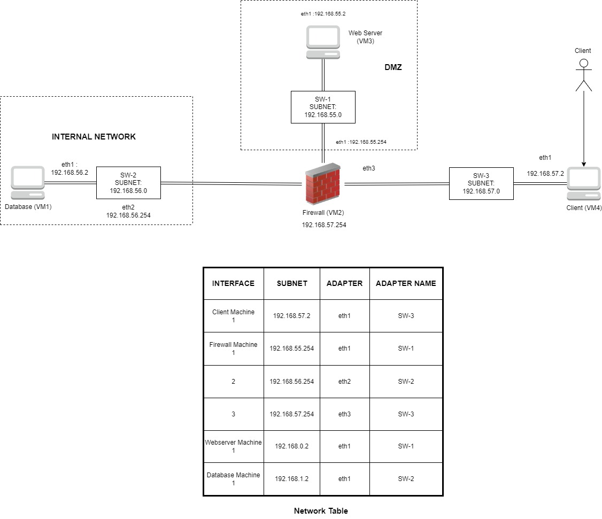
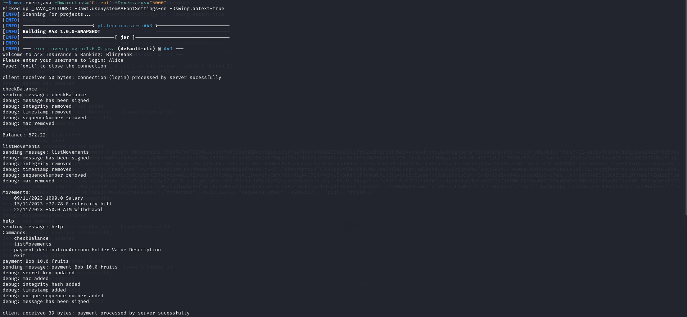

# A43 BLINGBANK

## TEAM

| Number | Name            | User                                         | E-mail                                           |
| -------|-----------------|----------------------------------------------| -------------------------------------------------|
| 102314 | Renato Martins  | <https://https://github.com/Renatotmmartins> | <mailto:renato.martins@tecnico.ulisboa.pt>       |
| 99300  | Pedro Rodrigues | <https://github.com/PedroDRodrigues>         | <mailto:pedro.dias.rodrigues@tecnico.ulisboa.pt> |
| 99340  | Tomás Marques   | <https://github.com/Tomas1610>               | <mailto:tomasduarte1610@tecnico.ulisboa.pt>      |

  
 
## CONTENTS

This repository contains documentation and source code for the *Network and Computer Security (SIRS)* project.  

The [REPORT](REPORT.md) document provides a detailed overview of the key technical decisions and various components of the implemented project.

It offers insights into the rationale behind these choices, the project's architecture, and the impact of these decisions on the overall functionality and performance of the system. 

This document presents installation and demonstration instructions.

## INSTALLATION

To see the project in action, it is necessary to setup a virtual environment, with at least 4 machines.

The following diagram shows the networks and machines:



There are two possible system configurations, and they are demonstrated in section 1 (Virtual Machines) and section 2 (Local Environment). It's important to note that only section 2 is fully functional at the moment.

### 1. MACHINE CONFIGURATIONS (VIRTUAL MACHINES)

For each machine, there is different steps that installs all the necessary packages and makes all required configurations in the a clean machine.


Use Git to obtain a copy of all the scripts and code inside WSL environment.

  
```sh

$  git  clone  https://github.com/tecnico-sec/a43-pedro-tomas-renato

```

Next we have custom instructions for each machine.

Enter atual folder and run the following commands to generate certificates:

```sh

$  sudo chmod +x setup_script.sh

$ ./setup_script.sh

```

Choose 'PT' for the country code, 'Lis' for the state or province name and 'changeme' for the password. In every other field just hit enter on the keyboard, leaving it blank. Then type 'yes' when asked if you trust the certificate. Do this for each one of the certificates. 
Then run this commands to go into the right folder to compile and install the project, placing its artifacts in the local Maven repository.

Now, in Powershell inside atual folder (where VagrantFile is located), run:

```sh

$  vagrant up

```

Now, all machines are created!

To set up each machine, enter VirtualBox Manager and show all of them.


#### 1.1 MACHINE 1 - DATABASE


This machine runs the database server (PostgreSQL).

To start the PostgreSQL service:

```sh

$  sudo service postgresql start

```

If the PostgreSQL service is not installed yet, please run:
```sh

$ sudo apt install postgresql 

```

Enter postgresql service:

```sh

$  sudo -u postgres psql

$ ALTER USER postgres WITH PASSWORD 'password';

$ CREATE DATABASE a43;

$  \q

```

Now it is necessary to enter in the database:


```sh

$  psql -U postgres -d a43 -h localhost 

```
Enter the password "password" to finish this operation.

To create a table named "bank_database" that will store our records, run :


```sh

$  CREATE TABLE bank_database( id SERIAL PRIMARY KEY, data JSONB );

```

Now the first machine is set up.


#### 1.2 MACHINE 2 - FIREWALL


This machine runs the firewall.

```sh

$  cd project/atual

$  sudo chmod +x firewall_setup.sh

$  ./firewall_setup.sh

$  mvn clean install

```

Now the firewall is ready to establish connections needed between machines.


#### 1.3 MACHINE 3 - WEBSERVER


This machine runs the server.

Start by running the following command, inside project/atual folder:

```sh

$  mvn clean install

```

Now the server is ready to be launched. Please do it using the command:

```sh

$  mvn exec:java -Dmainclass="Server"

```
The server is now connected to the database and ready to communicate with up to 10 clients.


#### 1.4 MACHINE 4 - CLIENT


The last machine to be set is the client.

Enter project/atual folder and run:

```sh

$  mvn clean install

$  mvn exec:java -Dmainclass="Client" -Dexec.args="5000"

```
The client should now be connected to the server.


### 2. EXECUTION ON LOCAL MACHINES

As we could not successfully create the machines, the program can be launched locally. For that, instead of launching the code on each machine, the client, the database and the server can be launched on independent terminals.

The steps to set up the system are simpler.

Open three different terminals.

To set up the database, in one of terminals, follow the same steps as outlined on Section 1.1 (MACHINE 1 - DATABASE).

Now in other terminal do the following steps:

```sh

$  git  clone  https://github.com/tecnico-sec/a43-pedro-tomas-renato

```

Enter atual folder and run the following commands to generate certificates:

```sh

$  sudo chmod +x setup_script.sh

$ ./setup_script.sh

```

Now you are ready to start server by running:

```sh

$  mvn clean install

$  mvn exec:java -Dmainclass="Server"

```

In the other terminal, for the client environment, do:

```sh

$  mvn clean install

$  mvn exec:java -Dmainclass="Client" -Dexec.args="5000"

```  

### DEMONSTRATION

Now that all the networks and machines are up and running, you can explore the different features of our program.
You can login as any user you want. If the user does not exist, a new account for him/her will be created. However, for the sake of this demonstration, please Log In as Alice (a user already existent on the database).
Check her balance and list her movements. Now make a payment to Bob and check the balance and list the movements again. Type 'help' if you need to know the existing commands of the program. You can exit the program. 
To execute this demonstration, please run on client environment: 

```sh

$  Alice
$  checkBalance
$  listMovements
$  help
$  payment Bob 10.0 fruits
$  checkBalance
$  listMovements
$  exit

```

  
  

This concludes the demonstration.

### LINKS TO USED TOOLS AND LIBRARIES

- [Java 11.0.16.1](https://openjdk.java.net/)

- [Maven 3.9.5](https://maven.apache.org/)

- [PostgreSQL](https://www.postgresql.org/)

  
### LICENSE

This project is licensed under the MIT License - see the [LICENSE.txt](LICENSE.txt) for details.