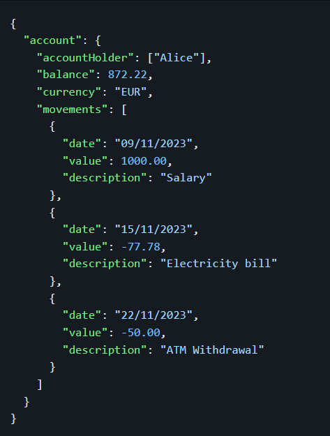
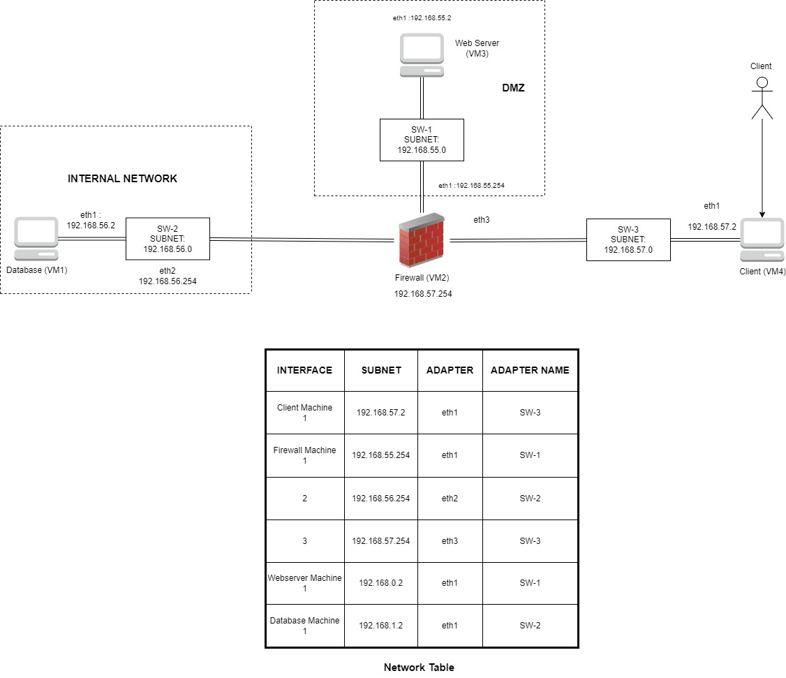
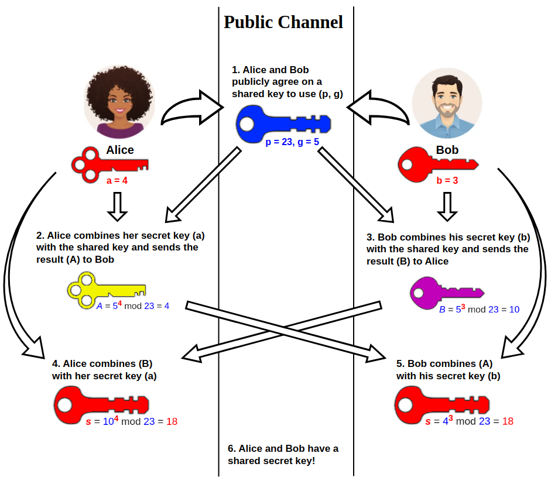
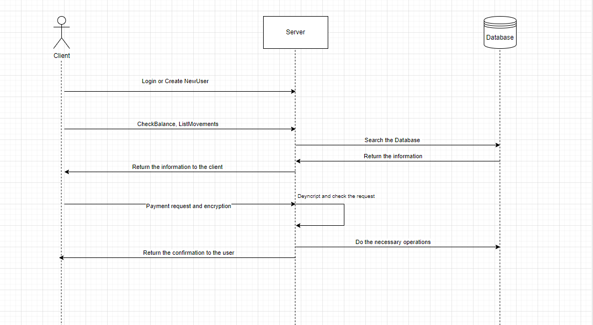

# BlingBank Project Report

## 1. Introduction

This project is a crucial component of our assessment in the SIRS (Segurança Informática em Redes e Sistemas) course. Our primary goal is to design and implement a security library, aiming to ensure both authenticity and confidentiality for all documents exchanged between the server and the client. The project was programmed using Java. The teachers have provided flexibility in guidelines, allowing us the freedom to choose the most optimal solution for achieving the desired security objectives.

BlingBank is a digital financial platform that focus attention on accessibility and convenience, offering online banking through a web application. It includes features such as account management for balance oversight and categorizing transactions for effective tracking, along with a user-friendly payment system.

We have been tasked with a security challenge focused on designing a payment order document format that ensures the confidentiality, authenticity, and non-repudiation of transactions. Simultaneously, the format must include safeguards against duplicate executions and enforce proper authorization for accounts with multiple owners. The proposed solution involves a dynamic key distribution system that regularly updates user keys, effectively minimizing the risk of compromise over time.

In order to maintain coherence and consistency, certain assumptions were made. The system is designed to accommodate a maximum of 10 users. A mechanism is in place to reject operations based on a five-minute deadline timer. We can assume that the user and the service share a secret key. It is also assumed that users will input data correctly according to the system's requirements. Proper input ensures that the system functions as intended and reduces the likelihood of errors or unexpected behavior. Messages confirming payments must be composed in the same manner as the payment transaction has been executed.

We were unable to carry out the implementation of the network. The plan is to deploy a system utilizing a DMZ topology, employing a single firewall to establish an additional layer between internal and external networks. Within this setup, the web server is situated in the DMZ, and the firewall serves as a reverse proxy, directing information from the web server to the database and facilitating connections between external machines (clients) and the web server.

The intended system operation is outlined as follows:

  - VM1: An external client initiating a connection to port 5000 on the web server.
  - VM2: A firewall responsible for redirecting all connections from the external network to the web server and managing connections from the web server to the database.
  - VM3: A web server machine receiving connections from the external network (clients) on port 5000 and establishing connections with the database on port 5432.
  - VM4: A database server machine receiving connections on port 5432 from the web server.

This system architecture is designed to enhance security by compartmentalizing network segments and controlling the flow of data through the implementation of a DMZ and a strategic use of a firewall as a reverse proxy.

## 2. Project Development

### 2.1. Secure Document Format

#### 2.1.1. Design

In the first phase of the project, focused on securing documents, there is a necessity for the development and deployment of a cryptographic library. In every distinct business scenario, exists a document format that presently lacks adequate protection. To address this gap, each team is tasked with employing suitable cryptographic techniques for safeguarding these documents. We have encrypted only values and keep keys readable. The custom cryptographic library will play an important role in fortifying the security of these core documents, ensuring their confidentiality and integrity. This strategic measure aims to enhance the overall resilience of the system against potential security threats. 

#### 2.1.2. Implementation

The security framework is composed by three different parts: check, protect, and unprotect, all of which leverage the Security library to manage document integrity, confidentiality, authenticity, and freshness. 

The protect component fortifies documents through the use of the Security Cryptographic Library. It employs a hybrid encryption approach, combining the efficiency of symmetric encryption with the secure key exchange facilitated by asymmetric encryption. The RSA (Rivest–Shamir–Adleman) is used to facilitate the secure key exchange between parties, with a asymmetric encryption, while the symmetric encryption is secured by AES in GMC mode (Advanced Encryption Standard with Galois/Counter Mode) based on the following reasons: introduces an authenticated mode (GCM) that ensures the integrity of the encrypted data, incorporates the Initialization Vector into the authentication tag that is unique for each encryption to maintain security and specifies NoPadding to avoid padding-related vulnerabilities. The protect process also includes applying integrity through hash functions and computing a MAC (Message Authentication Code) for the document. Freshness is maintained by attaching a timestamp and sequence number. In order to answer security challenge we had to implement a digital signature for message authentication and non-repudiation. For this purpose we choose RSA with SHA-256 to sign and verify digital signatures, ensuring that messages are authentic and the sender cannot deny sending them. 

The check function evaluates the validity of a protected document using HMAC-SHA-256 (Hash-Based Message Authentication Code with SHA-256) for integrity verification. First, it computes the MAC of the current document and compares it with the received MAC. If these two are equal, then we confirm the document's integrity. The document's freshness is also taken into consideration by examining its timestamp and sequence number, ensuring that the document is not repeated. This is particularly important to prevent replay attacks. 

The last component, the unprotect, reverses the protection process by decrypting the protected document. It validates integrity and ensures freshness by removing the document's timestamp and sequence number. The original document is then reconstructed, revealing the decrypted information.

Summarizing, these cryptographic operations utilize robust algorithms such as AES in GCM mode, RSA for key exchange, SHA-256 for hashing, HMAC-SHA-256 for MAC generation, and Digital Signatures using RSA with SHA-256. This comprehensive approach ensures a secure, tamper-resistant, and authenticated handling of sensitive information within the system.

### 2.2. Infrastructure

#### 2.2.1. Network and Machine Setup

Our architecture follows a three tier system:
    
  - {Client} - Allows to check the account balance, review transaction history and initiate straightforward payments.
  - {Server} - Manages application logic, secure communication with clients and secure data processing. It employs a multi-threaded approach to handle concurrent client connections and ensures secure communication through TLS protocols.
  - {Database} - To securely preserve information related to client data, as well as to record all transactions executed by them. 

This project was built in Java, constructed with Maven as the build automation tool and employs TLS-secured sockets for communication between clients and the server. Furthermore, it leverages the Postgresql database server for efficient data management. To enhance concurrency, the project integrates Apache Spark, allowing for parallel processing and distributed computing capabilities. 

#### 2.2.2. Server Communication Security

To secure all communication channels, we implemented an additional TLS layer that ensures integrity, authentication, non-repudiation, and confidentiality. Initially, the connection process for each user to the server operates as follows:  

The Diffie-Hellman key exchange is a cryptographic protocol that enables two entities, such as a client and a server, to establish a shared secret key enabling security to a communication channel. Each entity generates its private key and public key. The second phase involves the exchange of these public keys. The client sends its computed public key to the server, and the server reciprocates by sending its public key to the client. Upon receiving the counterpart's public key, each party independently work with its own private key and the received public key. Now established on both ends, can be used for secure communication (on encryption and decryption methods), providing attributes such as integrity, authentication, non-repudiation, and confidentiality. 

### 2.3. Security Challenge

#### 2.3.1. Challenge Overview

To address the security challenge of introducing a new document format for payment orders with strict requirements for confidentiality, authenticity, non-repudiation, and robust freshness measures, the following approach was undertake. 

The new payment order document format has been designed accordingly with our Security Library. We use hybrid encryption with the Advanced Encryption Standard (AES) in Galois/Counter Mode (GCM) for encrypting sensitive payment information. This ensures that the data is confidential and secure from unauthorized access. In addition to this, we implement digital signatures using asymmetric cryptography (RSA) to provide a means of verifying the origin and integrity of the payment orders. Each payment order will be signed by the sender to ensure authenticity. 

To answer non-repudiation feature, we employ digital signatures not only for authenticity but also to achieve non-repudiation. This ensures that the sender of the payment order cannot later deny having sent it, as the digital signature provides a cryptographic proof of the transaction's origin.

The freshness measures includes a timestamp and a unique transaction identifier in each payment order. The timestamp ensures that the order is recent, and the unique identifier prevents duplicate executions. Strict validation has been applied to ensure that orders are not accepted if they are beyond a specified time threshold (five minutes) or if a duplicate identifier is detected.

Furthermore, our system requires Multi-Owner Authorization. For accounts with multiple owners (e.g., Alice and Bob), introduce a mechanism that requires authorization and non-repudiation from all account owners before the payment order is executed. This may involve obtaining digital signatures from each owner and waiting for a confirmation message from each account holder.

The last point is the need for new keys and dynamic key distribution. We put into practice the generation of new cryptographic keys for users to meet the requirements of confidentiality, authenticity, and non-repudiation. For example, each user may have a pair of public and private keys for digital signatures.

By implementing these measures, the new document format for payment orders will provide a robust security framework that guarantees confidentiality, authenticity, and non-repudiation for each transaction. 

#### 2.3.2. Attacker Model

To prevent potential attack scenarios, we had to implement a robust defense taking in consideration a variety of threats:

  - An attacker attempts to intercept communication between the client and the server to gain access to sensitive information.
  - An adversary positions themselves between the client and server, intercepting and possibly altering the communication.
  - The attacker tries to compromise the database where sensitive client information is stored.
  - If an attacker gains access to the secret key shared between clients and server, it could lead to unauthorized access or data manipulation.
  - An attacker seeks to overwhelm the system by flooding it with traffic, causing service disruption.

These are some examples of possible threats and our solution takes it into account, as we use TLS secure sockets for communication between our processes, we ensure that the content of the messages traded between our client and server are encrypted and authenticated, and with the call of 'checkCommand' we're able to ensure the integrity and freshness of the received file json document. To mitigate replay attacks, our secure communication protocol incorporates timestamping in each message, capturing the precise generation time. Additionally, a sequence number verification mechanism ensures the uniqueness of messages.

#### 2.3.3. Solution Design and Implementation

Our solution desgin work as following figure:

The Client interface facilitates user interaction with the server, enabling the execution of various operations within our application. Upon initiation of the application by the user, a prompt is presented, requesting the entry of the user's name for authentication and login purposes. If the user possesses an existing account within the application, authentication will be granted, thereby permitting the execution of operations. In the absence of a pre-existing account, the system will automatically create a new one.

After the user is logged into the system, a wide variety of operations are available. A new account holder can be added to the list of current account holders of a specific account using the command: addAccountHolder 'Name of the new account holder'. The user can check the current balance of the account (with the command 'checkBalance'), can list the movements done on that account (with the command 'listMovements'), and can also execute new payments (with the command 'payment destinationAccountHolder value description'). If the account only has one account holder, the payment is processed immediately (of course, it has to meet all the security requirements mentioned above). However, if the account has more than one holder, all the owners of the account have to confirm the payment. This can be done by doing the following command on each account holder (except the one that initially requested the payment): 'confirm payment destinationAccountHolder value description'. Until this is done, the payment is not confirmed.

Our server is responsible for managing all the requests from the clients and accessing or retrieving data from our database.

When the server starts, the database is accessed, and all data on it from previous executions of the program is deleted. Then, some demo accounts are loaded into the database before the user logs in. Once started, the server will be listening for upcoming requests via TLS secure sockets. The established TLS connection employs mutual authentication to ensure that both the server and the client authenticate each other. The TLS protocol utilizes asymmetric key exchange methods, to securely generate and exchange session keys for encryption and decryption during the communication process. This ensures a secure and confidential channel between the server and the client.

Every time a new client sends its first request to our server (client starts and sends 'connecting' to our server), it will start a new thread for that specific client, up to a maximum of 10 simultaneous clients.

After this, every message sent from the client will be signed with a private key, in order to achieve authenticity, as the server has access to all clients' public keys and knows which client is communicating with. Since each one runs on a different thread, it is able to verify the authenticity of the message by verifying the digital signature, with the method 'verifySignature' included in our security library.

In the event that the server encounters difficulty in verifying the authenticity of a received message, it will reject it, responding to the source of the request with the message "Signature Not Valid." Upon successful verification of the request's authenticity, the server proceeds to execute either a read operation, such as 'checkBalance' or 'listMovements.' During these operations, the server conducts a query to select data associated with the current account holder, employing the 'protectDocument' method from the security library to safeguard the information. Every time this method is invoked, the secret key shared between the pair of client and server entities is updated, ensuring a proactive defense mechanism. Subsequently, the server transmits the protected data to the client to either enumerate all movements or verify the account balance. These attributes are encapsulated within the JSON document dispatched to the client. The client has the responsibility of parsing, decrypting, and extracting the relevant information from the JSON packet, depending on the request.

Alternatively, during a write operation like 'addAccountHolder,' the server expects an encrypted accountHolder string that identifies the new account holder. In this scenario, the server updates the JSON document in the database that belongs to the current account holder, appending the new account holder to the array. Simultaneously, the server generates a new set of keys for the newly added user.

The system may also receive payment requests accompanied by a protected JSON document. In such cases, the 'checkDocument' method in the security library is invoked to ensure the integrity and freshness of the received file. If no tampering is detected, the server proceeds to unprotect the document using the 'unprotectDocument' method from the security library. In instances where the account comprises multiple account holders, the server disseminates the payment message to each account holder and awaits their individual confirmations. Only after confirmation from all potentially involved account holders is obtained does the server scrutinize and validate the collective input. Subsequently, the server updates the database with the executed payment operation.

The foundation of our project's data management lies in PostgreSQL, a formidable open-source relational database management system (RDBMS). Renowned for its robustness, extensibility, and strict adherence to SQL standards, PostgreSQL played an essential role in ensuring the security and efficiency of our database.

Our database structure revolves around a meticulously crafted table featuring two key columns. The first, a Primary Key named "ID," serves as a unique identifier for each record. The second column, named "Data," is designed to store our data in JSON format (JavaScript Object Notation) objects. Leveraging the "jsonb" data type, we opted for a binary format, enhancing storage efficiency and retrieval speed.

This strategic use of PostgreSQL and the utilization of the "jsonb" data type enable us to seamlessly navigate and query our database, ensuring swift access to the precise records we require. The inherent flexibility of JSON objects, coupled with PostgreSQL's reliability, provides a solid foundation for the robust and extensible of our project data management system.

This is the core data handled by the application. In this example, we can see the database record of the account of a user called Alice. She is the single account holder of that account, currently has 872.22 € and a list of her movements, with each movement date, value and description.

## 3. Conclusion

In conclusion, the security framework implemented in the project is a robust and comprehensive solution designed to address key aspects of data protection, integrity, authenticity, and freshness in the context of document management, particularly focusing on payment orders, analysing balance and historic of movements. Our solution prioritizes security aspects, recognizing the inherent impossibility of complete security. One potential improvement involves implementing regular updates for user key pairs or introducing a secure, encrypted password stored in the database, which must be provided with each client request for added authentication.

## 4. Bibliography

https://www.ietf.org/rfc/rfc2631.txt

https://en.wikipedia.org/wiki/Diffie%E2%80%93Hellman_key_exchange

https://en.wikipedia.org/wiki/Galois/Counter_Mode
